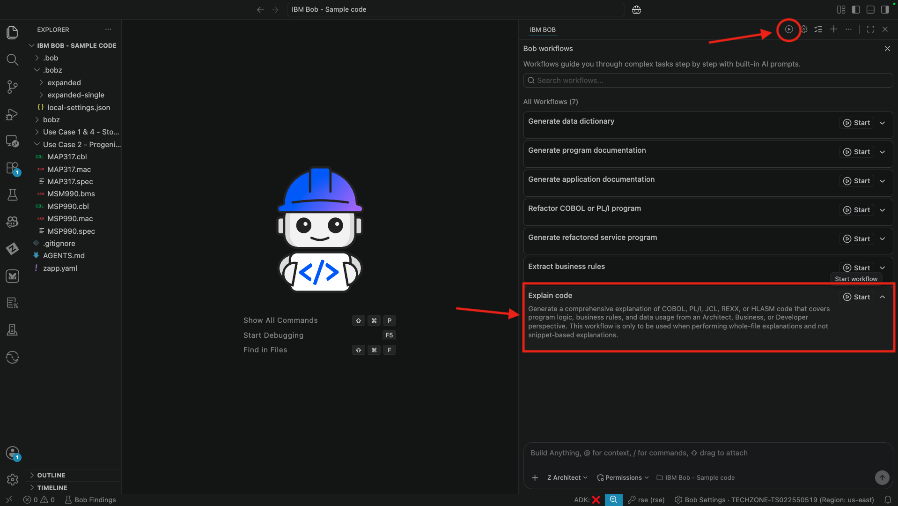
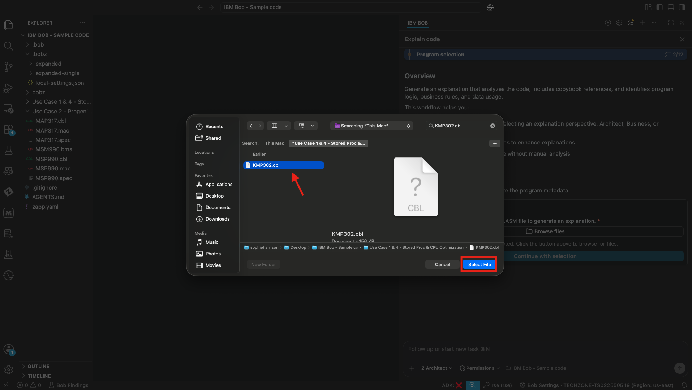
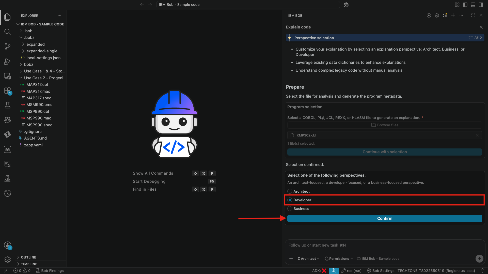
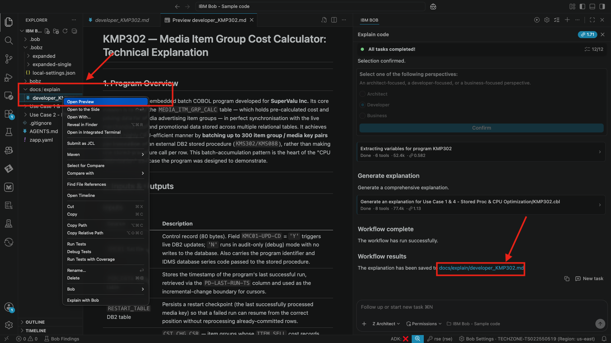
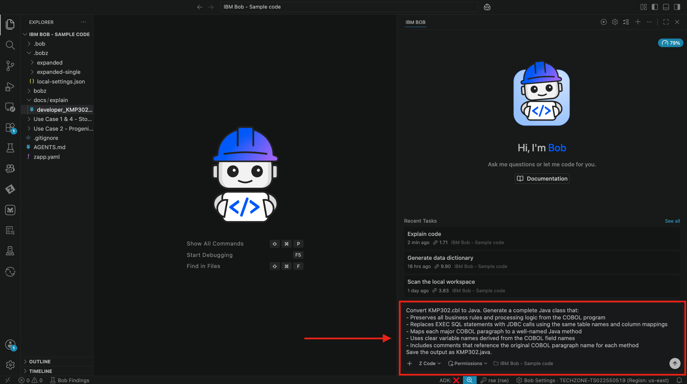
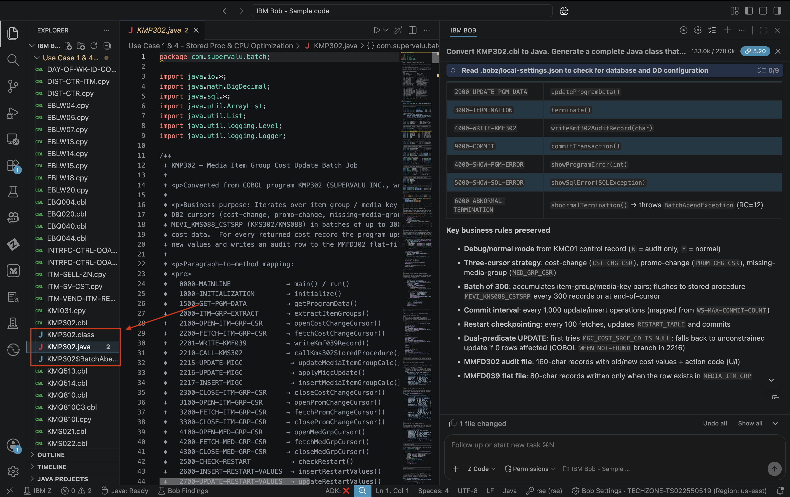
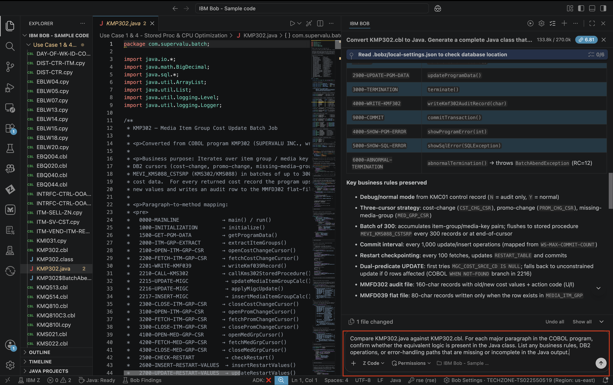
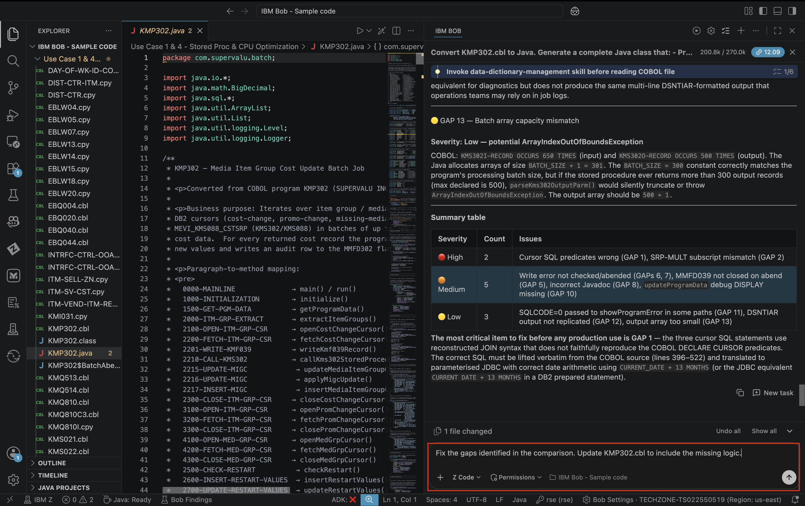

## Lab 2: Convert COBOL+DB2 Stored Procedures to Java

> **Prerequisites:** Complete Lab 1 (Getting Started) before starting this lab
>
> **Code Set:** Use Case 1 & 4 — `MMP193.cbl`, `KMQ810.cbl`, and associated copybooks
>
> **Duration:** 45 minutes
>
> **Difficulty:** Intermediate

---

### Overview

In this lab you will use IBM Bob to automatically analyze, translate, and modernize COBOL programs and DB2 stored procedures to efficient, maintainable Java code. Bob reads the existing COBOL logic, understands the DB2 access patterns, and generates equivalent Java code that preserves the business rules while producing clean, modern output ready for a Java runtime.

---

### Learning Objectives

By the end of this lab you will be able to:

- Use Bob to explain and document COBOL+DB2 stored procedure logic before conversion
- Generate a Java equivalent of a COBOL program that includes DB2 access
- Review the mapping between COBOL paragraphs and Java methods
- Understand how Bob preserves business rules during translation
- Identify any gaps or deviations between the original and generated output

---

### Exercise 1: Understand the COBOL Program Before Converting

Before converting, use Bob to explain what the program does. This gives you a baseline to verify the generated Java against.

#### Actions

> Ensure you are in **Z Architect** mode

1. In the chat, please select the workflow icon. Please select the explain code workflow and click start. 



2. Enter the following program *KMP302.cbl*

2. Please select developer. Approve any tool requests that appear. Bob will scan the program, read the copybooks it depends on, and query the metadata database.


3. Review the explanation carefully — this is your reference for verifying the Java output in Exercise 3.

#### Expected Results

- ✅ Plain-English description of the program's purpose
- ✅ DB2 access summary table (table name, operation type, purpose)
- ✅ Key business rules identified and explained
- ✅ Data flow described from input through processing to output

---

### Exercise 2: Generate the Java Equivalent

Point Bob at the COBOL program and ask it to produce the Java translation.

#### Actions

> Switch to **Z Code** mode

1. In the chat, enter the following prompt:

```
Convert KMP302.cbl to Java. Generate a complete Java class that:
- Preserves all business rules and processing logic from the COBOL program
- Replaces EXEC SQL statements with JDBC calls using the same table names and column mappings
- Maps each major COBOL paragraph to a well-named Java method
- Uses clear variable names derived from the COBOL field names
- Includes comments that reference the original COBOL paragraph name for each method
Save the output as KMP302.java.
```


2. Approve tool requests as they appear. Bob will read the source program, resolve copybook dependencies, and generate the Java file.

3. When complete, open `KMP302.java` in the editor and review the generated code.

#### Expected Results

- ✅ Java class generated and saved
- ✅ Each COBOL paragraph mapped to a Java method with a comment reference
- ✅ DB2 `EXEC SQL` statements replaced with JDBC equivalents
- ✅ Copybook field names carried through as Java field/variable names
- ✅ Business rules intact and readable

---

### Exercise 3: Verify the Conversion

Systematically check the generated Java against the original COBOL to confirm nothing was lost.

#### Actions

> Remain in **Z Code** mode

1. In the chat, enter the following prompt:

```
Compare KMP302.java against KMP302.cbl. For each major paragraph in the COBOL program, confirm whether the equivalent logic is present in the Java class. List any business rules, DB2 operations, or error-handling paths that are missing or incomplete in the Java output.
```

2. Review Bob's comparison report in the chat. If gaps are identified, ask Bob to fix them:

```
Fix the gaps identified in the comparison. Update KMP302.cbl to include the missing logic.
```

#### Expected Results

- ✅ Comparison report produced paragraph-by-paragraph
- ✅ All DB2 operations accounted for in the Java output
- ✅ Any gaps identified and corrected
- ✅ Final Java class is a complete, faithful translation of the COBOL program

---

### Key Takeaways

- Bob reads COBOL and DB2 patterns natively — no manual mapping or translation guides needed
- Explaining the program first gives you a verification baseline before conversion
- The paragraph-to-method mapping keeps the Java output traceable back to the original COBOL
- The verify step is essential — always review generated output against the source before accepting it

## Start a New Chat
Please select the **+** sign at the top of the chat window to start a new session before moving to the next lab.

