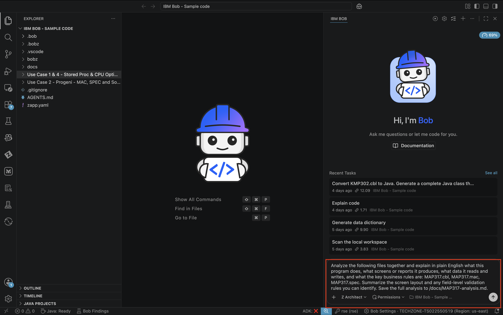
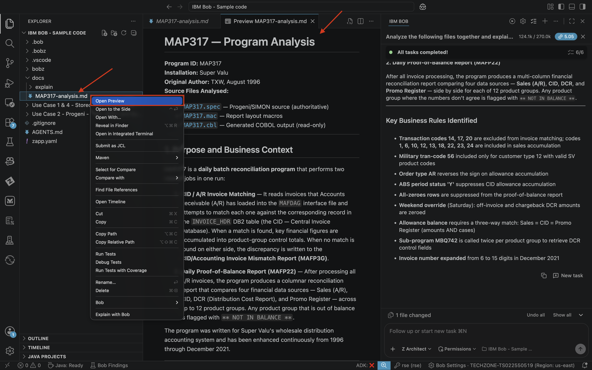
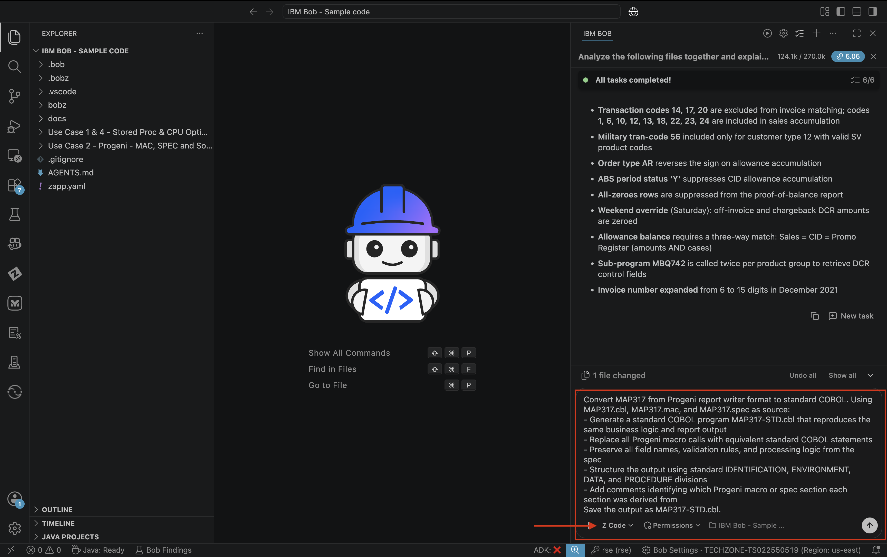
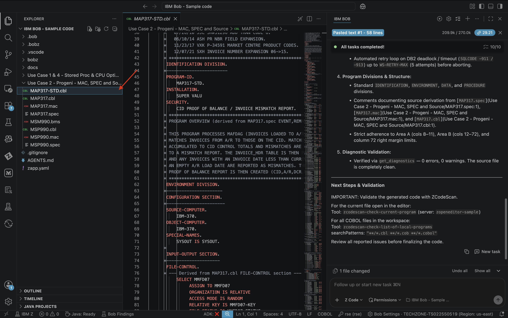
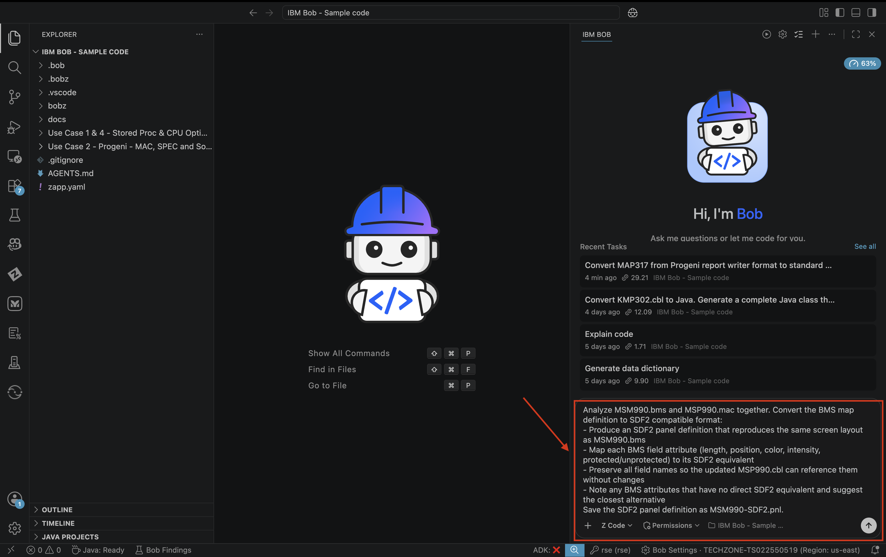
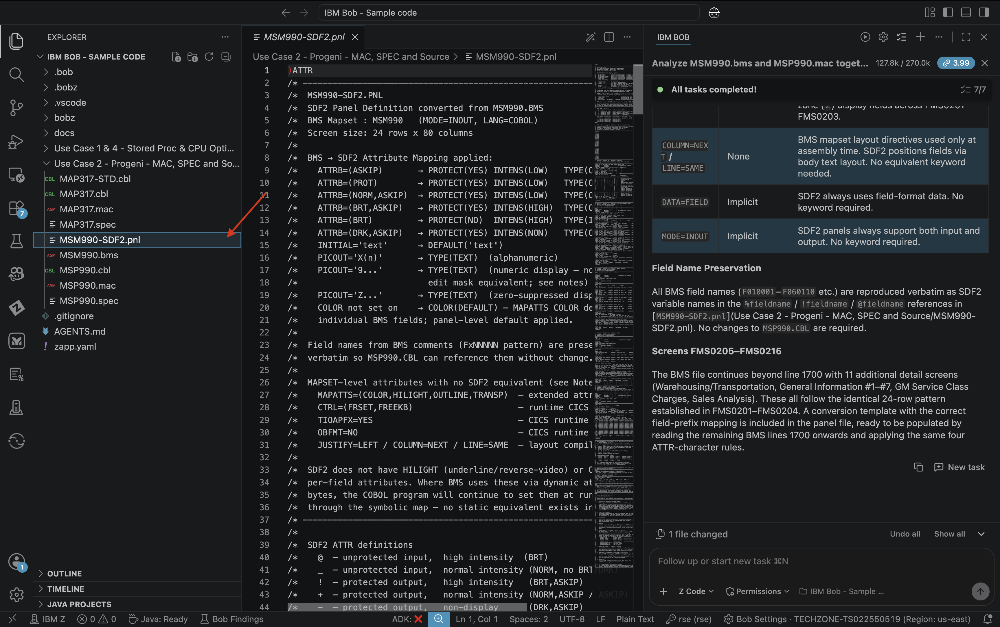

## Lab 3: Convert Progeni Report Writer Programs to Standard COBOL

> **Prerequisites:** Complete Lab 1 (Getting Started) before starting this lab
>
> **Code Set:** Use Case 2 — `MAP317.cbl`, `MSP990.cbl`, `MAP317.mac`, `MAP317.spec`, `MSP990.mac`, `MSP990.spec`, `MSM990.bms`
>
> **Duration:** 45 minutes
>
> **Difficulty:** Intermediate

---

### Overview

Progeni is a legacy report writer and screen generation tool that produces non-standard COBOL. Programs generated by Progeni use proprietary macro syntax (`.mac`) and specification files (`.spec`) that are not portable and cannot be maintained with standard tooling. In this lab you will use IBM Bob to analyze the Progeni source assets, understand the business logic embedded in them, and generate equivalent standard COBOL programs and SDF2-compatible CICS maps — enabling long-term maintainability with standard IBM tooling.

---

### Learning Objectives

By the end of this lab you will be able to:

- Use Bob to read and explain Progeni `.mac` and `.spec` source files
- Understand the screen layout and report structure captured in the Progeni assets
- Generate standard COBOL from a Progeni report writer program
- Convert a CICS BMS map to SDF2 compatible format
- Verify the converted output against the original Progeni specification

---

### Exercise 1: Understand the Progeni Source Assets

Before converting, use Bob to explain what the Progeni program and map do.

#### Actions

> Ensure you are in **Z Architect** mode

1. In the chat, enter the following prompt:

```
Analyze the following files together and explain in plain English what this program does, what screens or reports it produces, what data it reads and writes, and what the key business rules are: MAP317.cbl, MAP317.mac, MAP317.spec. Summarize the screen layout and any field-level validation rules you can identify. Save the full analysis to /docs/MAP317-analysis.md.
```


2. Approve any tool requests. Bob will read all three files and cross-reference them to produce a unified explanation.

3. Review the explanation — this is your reference for verifying the converted output.


#### Expected Results

- ✅ Plain-English description of the program's purpose and screen/report layout
- ✅ Field-level business rules and validations identified
- ✅ Data sources (files, DB2 tables, or COMMAREAs) documented
- ✅ Summary of what the `.mac` macros expand into in functional terms

---

### Exercise 2: Convert the Progeni Program to Standard COBOL

Generate a standard COBOL equivalent of the Progeni program.

#### Actions

> Switch to **Z Code** mode

1. In the chat, enter the following prompt:
##### Tip: We added some specifics to the prompt to help with generaton time during the lab!
```
Convert MAP317 from Progeni report writer format to standard COBOL.

Using MAP317.cbl, MAP317.mac, and MAP317.spec as source:

Generate a standard COBOL program MAP317-STD.cbl that reproduces the same business logic and report output
Replace all Progeni macro calls with equivalent standard COBOL statements
Preserve all field names, validation rules, and processing logic from the spec
Structure the output using standard IDENTIFICATION, ENVIRONMENT, DATA, and PROCEDURE divisions
Add comments identifying which Progeni macro or spec section each section was derived from
PROGENI FORMAT TRANSLATION RULES — apply these before writing any PIC clause derived from a .mac report field definition:

Picture symbol substitution
Progeni uses format codes inside picture strings that are not valid standard COBOL symbols. Replace every occurrence:

ZD → Z (e.g. ZD9 → Z9, Z,ZZZ,ZD9.99- → Z,ZZZ,Z9.99-)
D → Z (same rule; trailing D before a digit means "suppress zero here and place minus adjacent")
After substitution, verify the resulting PIC string contains only the characters: 9 A B E G N P S V X Z . , + - / * $ 0 and parenthesised repeat counts. Any other character is a Progeni format code and must be substituted or removed.

PRINTDETAIL macro → WRITE FROM
Each PRINTDETAIL <report-name> call becomes:

MOVE <ws-line-buffer> TO <fd-record>
WRITE <fd-record> AFTER ADVANCING 1 LINE

Open the report file with OPEN OUTPUT before the first write. Manage a line counter and issue WRITE ... AFTER ADVANCING PAGE when the page limit is reached, then reprint the column headers.

PROCESS loop → PERFORM UNTIL
Each PROCESS <file>, WHEN <condition> block becomes a READ <file> AT END SET <eof-flag> TO TRUE / NOT AT END loop driven by PERFORM UNTIL <eof-flag>. The WHEN condition becomes an IF/EVALUATE guard inside the loop body; records that do not match the condition are skipped with CONTINUE and the loop reads the next record.

COLUMN-72 RULE — apply to every source line written:

COBOL column 72 is a hard right margin. Any token that starts or continues past column 72 is silently truncated by the compiler with no error. Before writing each line:

Count the last meaningful character against the ruler below
If it lands past column 72, split the line at a natural clause boundary and continue in Area B (columns 12–72) of the next line
Pay special attention to REDEFINES target names, VALUE literals, and EXEC SQL host variable lists — these are the most common overflow points
         1         2         3         4         5         6         7
1234567890123456789012345678901234567890123456789012345678901234567890123456789
                                                                       ^col 72

TIMEOUT-SAFE WRITING STRATEGY — mandatory:

The PROCEDURE DIVISION is large (~25 paragraphs). Write it in small named chunks using one insert_content call per chunk. Never attempt to write more than ~80 lines in a single call. Use this chunk order:

PROCEDURE DIVISION header + MAINLINE + EOJ + CLOSE-DOWN
File open / read / close utility paragraphs
ACCUM-SALES-CUST-CHARGE (MAFD07 PROCESS loop)
INITIAL-PARA — initialisation logic
DB2 cursor paragraphs — DECLARE / OPEN / FETCH / CLOSE for all 3 cursors
PROCESS-MAFDAG-LOOP — MAFDAG PROCESS loop with header cursor inner loop
GET-MISMATCHES + mismatch cursor open/close
CREATE-PROOF-OF-BAL-REPORT + GET-PROM-REG-AMTS
CHECK-COLUMN-BALANCE + CHECK-COLUMN-ZEROES
PRINT-PRODUCT-DETAIL + INIT-CTRL-TOTALS
Report write paragraphs — WRITE-MAFP3G-LINE, WRITE-MAFP22-LINE, header printing
After all chunks are written, run get_diagnostics and fix every error before declaring the task complete.

Save the output as MAP317-STD.cbl.
```


2. Approve tool requests as Bob works through the source assets and generates the output.

3. When complete, open `MAP317-STD.cbl` and review the generated program.



#### Expected Results

- ✅ Standard COBOL program generated with all four divisions
- ✅ All Progeni macro calls replaced with standard COBOL equivalents
- ✅ Business logic and field validations from the spec preserved
- ✅ Comments trace each section back to the originating Progeni asset
- ✅ Program compiles without Progeni-specific dependencies

---

### Exercise 3: Convert the CICS BMS Map to SDF2 Format

Convert the BMS map to SDF2-compatible format for long-term screen maintainability.

#### Actions

> Remain in **Z Code** mode

1. In the chat, enter the following prompt:

```
Analyze MSM990.bms and MSP990.mac together. Convert the BMS map definition to SDF2 compatible format:
- Produce an SDF2 panel definition that reproduces the same screen layout as MSM990.bms
- Map each BMS field attribute (length, position, color, intensity, protected/unprotected) to its SDF2 equivalent
- Preserve all field names so the updated MSP990.cbl can reference them without changes
- Note any BMS attributes that have no direct SDF2 equivalent and suggest the closest alternative
Save the SDF2 panel definition as MSM990-SDF2.pnl.
```


2. Approve tool requests and review the generated panel definition.

#### Expected Results



- ✅ SDF2 panel definition generated from the BMS source
- ✅ Field names preserved for COBOL program compatibility
- ✅ Screen layout (positions, lengths, attributes) faithfully reproduced
- ✅ Any attribute gaps noted with recommended alternatives

---

### Exercise 4: Verify the Conversion

Check the converted COBOL program against the original Progeni specification.

#### Actions

> Remain in **Z Code** mode

1. In the chat, enter the following prompt:

```
Compare MAP317-STD.cbl against MAP317.spec. For each requirement in the spec, confirm whether the standard COBOL program fulfills it. List any missing validations, incorrect field mappings, or business rules that were not carried over.
```

2. If gaps are found, ask Bob to correct them:

```
Fix the gaps identified in the comparison and update MAP317-STD.cbl.
```

#### Expected Results

- ✅ Spec-by-spec comparison produced
- ✅ All field validations and business rules accounted for
- ✅ Any gaps corrected in the final output

---

### Key Takeaways

- Bob reads Progeni `.mac` and `.spec` files natively alongside the COBOL source — no manual extraction needed
- The `.spec` file is the authoritative reference for verification; always compare the generated output against it
- Preserving field names during conversion ensures the converted COBOL program works with existing calling programs without interface changes
- The BMS → SDF2 conversion retains screen layout fidelity while enabling the map to be maintained with standard IBM tooling


## Start a New Chat
Please select the **+** sign at the top of the chat window to start a new session before moving to the next lab.
